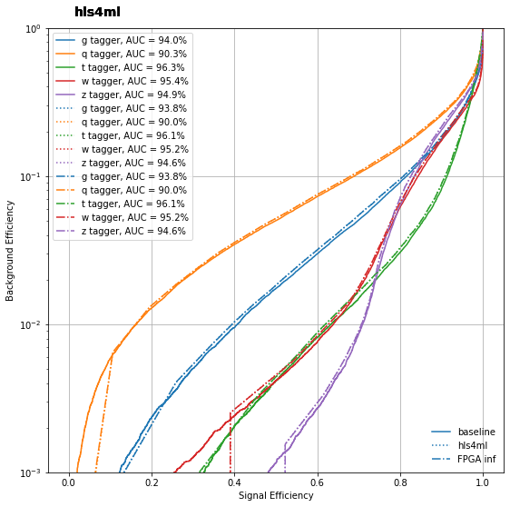

# PYNQ_IA
## Code
The files are organized as follows
- **`NN_train`**  : which contains the notebooks used to create and save the Keras and Qkeras models.
- **`PYNQ_files`** : which contains the .bit and .hwh files needed to load the overlay (exported from Vivado 2020.1), it contains also the notebook ran on the board.   
  
It is used a different  **`hls4ml`** version from actual release (0.5.0), to install it run the following command:  
```
pip install git+https://github.com/jmduarte/hls4ml.git@pynq#egg=hls4ml[profiling]
```
This specific hls4ml branch can be found [here](https://github.com/jmduarte/hls4ml/tree/pynq) and the original notebooks [at this link](https://github.com/jmduarte/pynq_hls4ml) 

## Results

The test are performed on a PYNQ-Z2 board equipped with **`xc7z020clg400-1`** ZYNQ FPGA.  

### Resurces

Here are presented the resources estimated by vivado and the actual utilization on the optimized model.
|Model              |BRAM[\%]|DSP[\%]|FF[\%]|LUT[\%]|
|-------------------|--------|-------|------|-------|
|Vanilla            |45      |123    |31    |101    |
|Quntized+Pruned    |18      |91     |20    |114    |
|FPGA implementation|3       |87     |17    |34     |

### Latency
As it is clear the main bottlenecks are the PS-PL interface (AXI memory mapped) and the encode-decode performed on the PS side, to lower the first it is possible to perform burst transfers employing a DMA (transfer data via DDR memory), to alleviate the second issue the functions for encoding and decoding can be vectorized.  

These problems can be avoided entirely if the input and output are preprocessed in the PL side, leaving the PS only the result analysis.

### Comparisons
<center>
    
</center>
