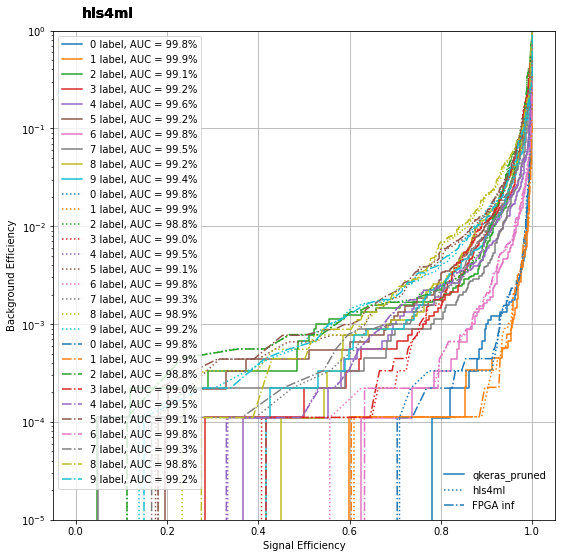

# PYNQ_IA

Here are presented two examples of FPGA neural network inference, namely the jet tagging and MNIST classification.  

It is used **`hls4ml`** 0.6.0 version,to install it run the following command (with also the profiling features):  
```
pip install hls4ml[profiling]
```

## Code
The files are organized as follows
- **`NN_train`**  : which contains the notebooks used to create and save the Keras and Qkeras models.
- **`PYNQ_files`** : which contains the .bit and .hwh files needed to load the overlay (exported from Vivado 2020.1) and the notebooks ran on the board.   
  


## Results

The tests are performed on a PYNQ-Z2 board equipped with **`xc7z020clg400-1`** ZYNQ FPGA.  

### Resources [jet tagging]

Here are presented the resources estimated by vivado and the actual utilization on the optimized model.
|Model              |BRAM[\%]|DSP[\%]|FF[\%]|LUT[\%]|
|-------------------|--------|-------|------|-------|
|Vanilla            |45      |123    |31    |101    |
|Quntized+Pruned    |18      |91     |20    |114    |
|FPGA implementation|3       |87     |17    |34     |  

### Resources [MNIST classification -CNN-]

|Model              |BRAM[\%]|DSP[\%]|FF[\%]|LUT[\%]|
|-------------------|--------|-------|------|-------|
|Vanilla            |-       |-      |-     |-      |
|Quntized+Pruned    |41      |4      |24    |109    |
|FPGA implementation|33      |5      |21    |35     |

### Resources [MNIST classification -DNN-]

|Model              |BRAM[\%]|DSP[\%]|FF[\%]|LUT[\%]|
|-------------------|--------|-------|------|-------|
|Vanilla            |-       |-      |-     |-      |
|Quntized+Pruned    |149     |4      |49    |325    |
|FPGA implementation|68      |5      |47    |68     |

### Performance
|Device             |t<sub>img</sub><sup>CNN</sup>[&#956;s]|t<sub>img</sub><sup>DNN</sup>[&#956;s]|
|-------------------|--------------------------------------|--------------------------------------|
|CPU[3700X]         |95                                    |24                                    |
|GPU[RX 580]        |30                                    |22                                    |
|ZYNQ[PYNQ_Z2]      |87                                    |85                                    |
|ALVEO[u50]         |21                                    |9                                     |
As it is clear the main bottlenecks are the PS-PL interface (AXIS DMA), to transfer and to read back a single frame at least 60 microsendos are required, this number is found with a large transfer (10000 frames), with a smaller buffer size the time per image will degrade.

### Comparisons
<center>
    
</center>  

<center>
    
</center>
